# 在一塊板子上做出會「看」的東西

> 寫給會寫韌體、但沒碰過機器學習的人。
> 假設你懂 C、懂 flash、懂暫存器；**不**假設你知道什麼是卷積、什麼是訓練。
>
> 要查分區表、指令、實測數字 → [REFERENCE.md](REFERENCE.md)

---

## 這份文件要帶你做出什麼

一台會跟你猜拳的板子。

你出剪刀，板子上的鏡頭看到，板子自己判斷你出什麼、自己出一個、自己判輸贏。
全程不連網路，不靠手機，不靠雲端。板子上就一顆 500 MHz 的 Cortex-M33。

聽起來很難，實際上整條路只有四步：

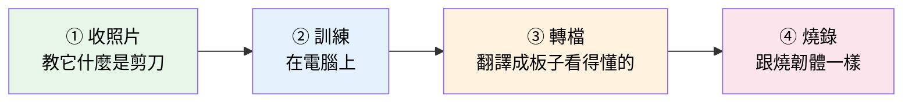

前八章講**為什麼**，後四章講**怎麼做**。
如果你只想動手，直接跳到第 9 章；但第 12 章請一定要看，那章會省你兩天。

---

# 第 1 章　先承認一件事：這跟你平常寫程式不一樣

你平常寫程式是這樣的：

```c
if (temperature > 40) {
    fan_on();
}
```

**規則是你寫的。** 你知道 40 是怎麼來的，出錯了你可以一行一行看。

現在請你用同樣的方式，寫一個函式判斷照片裡的手是剪刀還是石頭：

```c
int is_scissors(uint8_t *image, int w, int h) {
    // ...然後呢?
}
```

卡住了對吧。因為你根本說不出「剪刀」的規則是什麼。

- 兩根手指伸出來？那如果手轉了 45 度呢
- 膚色區域的輪廓？那如果背景也是膚色呢
- 數手指的數量？那要先會找手指，這本身就是同一個問題

**這就是機器學習存在的理由：有一類問題，人類做得到但講不出規則。**

| | 傳統寫程式 | 機器學習 |
|---|---|---|
| 你提供 | **規則** | **例子** |
| 電腦產出 | 答案 | **規則** |
| 出錯時 | 看程式碼 | 看資料 |
| 適合 | 規則講得出來 | 規則講不出來 |

最後一列是重點：**出錯的時候你不是去改程式，是去改資料。**
這個轉換非常不直覺，後面第 12 章會讓你體會到。

---

# 第 2 章　一張照片在電腦裡是什麼

這章是基礎，但如果你只寫過 UART 和 GPIO，可能沒仔細想過。

一張 96×96 的彩色照片，就是 **96 × 96 × 3 = 27,648 個 byte**。

```
每個位置 3 個數字,每個 0~255
(0,0) → R=210 G=180 B=140     ← 偏膚色
(0,1) → R=208 G=178 B=139
...
```

就這樣。**沒有「手」這個東西，只有兩萬多個數字。**

所以「認出剪刀」這件事，本質上是：

```
輸入:27,648 個數字
輸出:3 個數字(是石頭的程度、是布的程度、是剪刀的程度)
```

**這就是一個函式。** 一個有 27,648 個輸入、3 個輸出的函式。
機器學習做的事，就是**把這個函式找出來**。

### 一個你會關心的細節：數字怎麼排

同樣是 RGB，排法有兩種：

```
interleaved（交錯）  R G B  R G B  R G B ...    ← 一般照片、螢幕
planar（分層）       R R R ... G G G ... B B B  ← ★ NPU 要的
```

這件事後面會咬你一口——排錯了，程式不會當，也不會報錯，
就只是**答案全錯**。第 10 章會講。

---

# 第 3 章　模型：一台有二十萬個旋鈕的機器

既然是找一個函式，怎麼找？

答案是：**先準備一台有超多旋鈕的機器，再把旋鈕轉到對的位置。**


我們的猜拳模型有 **208,227 個旋鈕**。每個旋鈕就是一個小數。

> 這些旋鈕有個正式名字叫**權重（weights）**。
> 「訓練模型」= 找出這 208,227 個數字該是多少。
> 「模型檔案」= 就是這 208,227 個數字存成一個檔。

### 旋鈕是怎麼接的

不是亂接的，是分層的。像類比電路的多級放大：

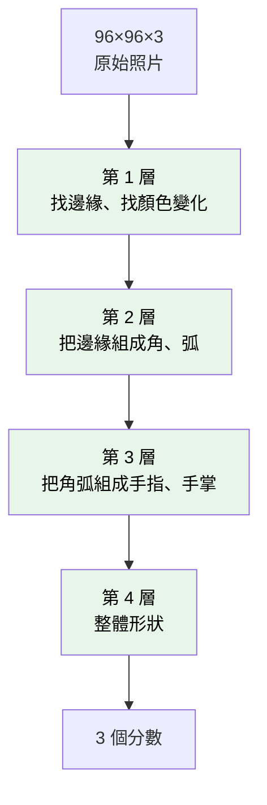

**前面的層看細節，後面的層看整體。** 這個階層不是人設計的，是訓練時自己長出來的。

### 每一層實際在算什麼

拆到最底層，只有一種運算：

```c
acc = 0;
for (i = 0; i < n; i++) {
    acc += input[i] * weight[i];   // 乘 + 加
}
```

**就這樣。** 乘起來、加起來。這個動作叫 **MAC**（Multiply-Accumulate，乘加）。

整個猜拳模型辨識一張照片，要做 **30,670,000 次 MAC**。

> 記住這個數字。它是後面所有效能討論的起點——
> 不管 CPU 還是 NPU，大家在比的都是「一秒能做幾次 MAC」。

---

# 第 4 章　訓練：怎麼把二十萬個旋鈕轉到對的位置

二十萬個旋鈕，一個一個試是不可能的。實際做法意外地簡單：

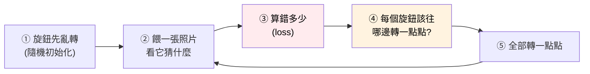

第 ④ 步是整件事的核心，也是唯一需要數學的地方（微分），
但你**不需要自己算**——TensorFlow 幫你算。

### 用你熟悉的東西類比

這跟 **PID 自動整定**、或**自動增益控制**是同一件事：

| AGC | 訓練 |
|---|---|
| 量測輸出準位 | 量測預測結果 |
| 跟目標比，得到誤差 | 跟正確答案比，得到 loss |
| 調整增益一小步 | 調整權重一小步 |
| 重複到收斂 | 重複到 loss 不再下降 |
| 旋鈕：1 個 | 旋鈕：208,227 個 |

**差別只在旋鈕的數量，原理一模一樣。**

### 幾個你會在畫面上看到的字

跑訓練的時候 Colab 會一直印東西，這幾個看懂就夠：

| 看到 | 意思 | 你該有的反應 |
|---|---|---|
| `Epoch 7/30` | 全部資料跑完第 7 遍 | 正常 |
| `loss: 0.42` | 錯得多嚴重，**越小越好** | 要一路往下 |
| `accuracy: 0.87` | 猜對的比例 | 要一路往上 |
| `val_accuracy: 0.61` | 用**沒看過的**資料考，猜對的比例 | ★ **只看這個** |

**為什麼只看 `val_accuracy`**：`accuracy` 是拿它讀過的考古題考它，
背起來就 100% 了，不代表會。`val_` 開頭的才是沒看過的新題目。

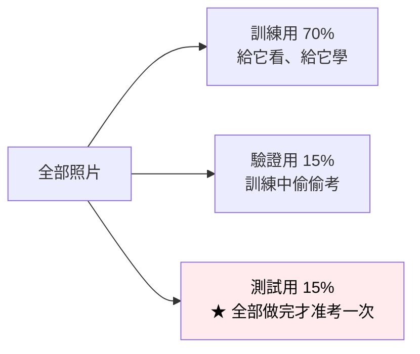

> 測試集只能用一次。你如果看了測試成績再回去調模型，
> 測試集就變成你的考古題了，成績就開始說謊。

---

# 第 5 章　TensorFlow 到底在扮演什麼角色

一句話：**它是編譯器，不是執行環境。**

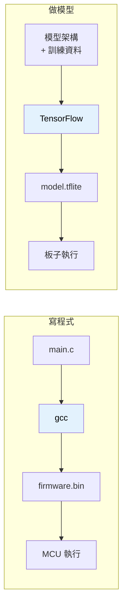

| 寫程式 | 做模型 |
|---|---|
| 你寫 `.c` 原始碼 | 你寫模型架構 + 準備資料 |
| **gcc** 編譯 | **TensorFlow** 訓練 |
| 產出 `.bin` | 產出 `.tflite` |
| MCU 上**沒有** gcc | 板子上**沒有** TensorFlow |

**最後一列最重要。**
你不會把 gcc 塞進 MCU，同樣地，**板子上沒有 TensorFlow，也不需要有**。

TensorFlow 只活在你的電腦（或 Colab）上，工作是把 208,227 個旋鈕轉到對的位置。
轉完、存檔，它的任務就結束了。

### 那 `.tflite` 是什麼

就是**那 208,227 個數字 + 一張「怎麼接線」的圖**，打包成一個檔案。

> ⚠ 名字很容易誤導：`.tflite` 聽起來像「要在板子上跑 TensorFlow Lite」。
> **在我們這條路上不是。** 它只是一個中繼檔案格式，
> 接下來要被翻譯成 NPU 看得懂的東西（第 7 章）。

---

# 第 6 章　NPU 是什麼，為什麼它快

現在你知道辨識一張照片要做 3067 萬次 MAC。

### CPU 怎麼做

```c
for (i = 0; i < 30670000; i++) {
    acc += a[i] * b[i];
}
```

Cortex-M33 有 DSP 指令，一個 cycle 大概能做一次 MAC（實測是 4.5 cycles，
因為還要從記憶體搬數字）。

```
30,670,000 × 4.5 cycles ÷ 150 MHz ≈ 0.9 秒
```

**快一秒。** 猜拳遊戲一秒才動一次，沒辦法用。

### NPU 怎麼做

NPU 裡面沒有「通用處理器」，只有**一大片乘加器排排站**：

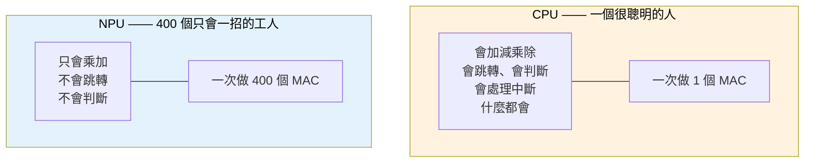

這 400 個乘加器**同時**動。這就是 NPU 的全部祕密——沒有魔法，就是**堆數量**。

### TOPS 就是這樣算出來的

規格書寫 AMB82 是 **0.4 TOPS**（Tera Operations Per Second，每秒一兆次運算）：

```
   400 個乘加器
 ×   2  （一次 MAC = 一次乘 + 一次加 = 2 個 operation）
 × 500 MHz
 ─────────────────────────
 = 400,000,000,000 ops/s
 = 0.4 TOPS
```

反過來也能用：看到規格書寫 TOPS，除以 2 再除以時脈，就知道**硬體大概有多寬**。

### 我們實測的結果

| | 一次 MNIST 推論 |
|---|---|
| Pico 2 CPU（int8 + 手工優化） | **40 ms** |
| AMB82 NPU | **0.12 ms** |

**差 330 倍。**

但這裡有個誠實的地方要講：

> **我們只用到 NPU 的 5.5%。**
>
> 理論上 0.4 TOPS 跑這個模型只要 6.7 µs，實測 121.8 µs。
> 因為 MNIST 太小——第一層只有 3 個輸入通道，400 個乘加器大半在發呆。
>
> **模型越小，NPU 的利用率越低。** 這跟直覺相反，但很重要：
> 拿小模型去 benchmark NPU，對 NPU 不公平。

還有一個更誠實的：**端到端只快 13.4 倍**，因為 96% 的時間在等作業系統的排程，
根本不是 NPU 在算。細節在 [REFERENCE.md](REFERENCE.md) Part 5。

---

# 第 7 章　為什麼不能把 `.tflite` 直接丟進板子

因為 NPU **不會執行程式**。

這句話要停下來想一下。你的直覺是「NPU 是個處理器，餵它指令就好」——不是的。

| | CPU | NPU |
|---|---|---|
| 有指令集嗎 | 有（ARM Thumb-2） | **沒有給你寫的** |
| 怎麼工作 | 取指令 → 解碼 → 執行 | **被組態成一條固定的資料流** |
| 能跑迴圈嗎 | 能 | **不能，一切都要事先展開** |
| 吃什麼 | `.bin` 指令序列 | **`.nb` 一張編譯好的算圖** |

### 那 `.nb` 裡面到底是什麼？

不是數學式，不是 C 程式碼。我把我們自己產的 `.nb` 打開給你看：

```
$ xxd -l 64 models/rps_cnn.nb

00000000: 5650 4d4e 1a00 0100 ad00 0000 7270 735f  VPMN........rps_
00000010: 636e 6e5f 7569 6e74 385f 4e48 5743 0000  cnn_uint8_NHWC..
00000020: 0000 0000 0000 0000 0000 0000 0000 0000  ................
00000030: 0000 0000 0000 0000 0000 0000 0b00 0000  ................
```

看得出結構：

| 位置 | 內容 | 意思 |
|---|---|---|
| `0x00` | `VPMN` | magic number，就像 ELF 的 `\x7fELF` |
| `0x04` | `1a00 0100` | 格式版本 |
| `0x0C` | `rps_cnn_uint8_NHWC` | 網路名稱（固定長度欄位，補 0） |
| `0x4C` 之後 | `0b 00 00 00`… | 一串計數：幾層、幾個輸入、幾個輸出 |
| 再往後 | 一大坨二進位 | **權重 + 指令序列 + 記憶體配置表** |

**所以 `.nb` 之於 NPU，就是 `.bin` 之於 MCU。**
它是一個編譯產物，裡面是：

1. **權重** —— 那 208,227 個數字（量化成 uint8）
2. **指令序列** —— 第幾個硬體單元、從 DDR 哪個位址讀、算完寫回哪裡、重複幾次
3. **配置表** —— 每一層的中間結果放哪、怎麼切塊（tiling）

轉檔器的工作，就是把「Conv → Pool → Conv」這種抽象描述，
**排成一條這顆 NPU 的硬體真的能執行的資料流**。

> **推論：`.nb` 不可攜。** 換一顆不同的 NPU 就要重新轉一次，
> 就像 ARM 的 `.bin` 不能丟到 RISC-V 上跑。

### 順便：量化是什麼

轉檔的時候還會做一件事——把權重從 `float32` 壓成 `uint8`。

```
訓練時   0.0374829471...   4 bytes
量化後   38                1 byte
```

**像把 3.14159265 寫成 3.14。** 精度掉一點，但：

| | 好處 |
|---|---|
| 檔案 | 小 4 倍 |
| 算 | 整數乘法比浮點快很多 |
| 耗電 | 少很多 |

代價是準確率會掉一點點（通常 1% 以內）。**這個交易在 MCU 上幾乎永遠划算。**

---

# 第 8 章　相機的畫面是怎麼進到 NPU 的

你可能以為是這樣：

```c
uint8_t buf[96*96*3];
camera_read(buf);        // ← 沒有這種東西
npu_run(buf);
```

**實際上不是。** KM4（你的 CPU）從頭到尾**沒有碰到任何一個畫素**。

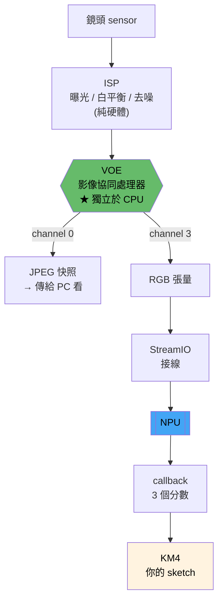

**畫素從 VOE 直接流到 NPU，不經過你的程式。**

你的 sketch 只做兩件事：

```cpp
// ① 開機時:跟 VOE 說要哪幾路、什麼格式
VideoSetting configNN(224, 224, 10, VIDEO_RGB, 0);
videoStreamerNN.registerInput(Camera.getStream(CHANNELNN));
videoStreamerNN.registerOutput(imgclass);      // ← 接線,就這樣

// ② 每一幀:從 callback 收結果
void onResult(void *p) {
    ImageClassificationResult res(p);
    int cls = res.classID();       // 0=石頭 1=布 2=剪刀
}
```

這就是為什麼 `Camera.getImage()` 回傳的是**一個位址和一個長度**，不是一個陣列——
那張圖是 VOE 寫進 DDR 的，你只是拿到「東西在哪裡」。

> 這個設計跟 DMA 是同一個思路：資料搬運交給專用硬體，CPU 只管設定和收通知。

### 三個會讓你抓狂的實際行為

| 現象 | 原因 |
|---|---|
| 按 RESET 沒用，相機還是怪怪的 | **VOE 不吃 RESET**。要拔 USB 等 5 秒再插 |
| 只開 channel 3 就 `hal_video_open fail` | channel 0 也必須開，就算你不用 |
| 設 320×240，拿到 480×360 | VOE 會把你的要求「吸附」到它支援的規格，而且不講 |

**永遠不要假設你設定的就是你拿到的。印出來看。**

---

# 第 9 章　動手（一）：訓練

從這裡開始是實作。教材是 Colab notebook，你自己跑。

📓 [`colab/02_train_rps.ipynb`](colab/02_train_rps.ipynb) —— 第一次，用現成的公開資料
📓 [`colab/025_retrain_rps.ipynb`](colab/025_retrain_rps.ipynb) —— 第二次，用**你自己的相機**拍的

### 為什麼要做兩次

第一次是**先跑通流程**。用現成資料，不用自己拍照，半小時就能看到板子動起來。

第二次才是**做出真的能用的東西**。原因在第 12 章。

### 第一次會經過的步驟

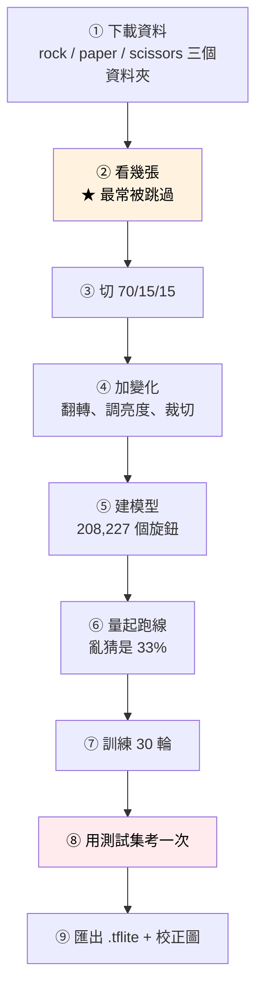

### 三件一定要知道的事

**1. 第 ② 步不要跳。**
訓練前先用眼睛看幾張圖。你會發現「喔原來背景都是白的」——
這個觀察在第 12 章會變成關鍵。

**2. 第 ④ 步（augmentation）不能放進模型裡。**

```python
# ✗ 這樣寫,第 10 章轉檔會直接失敗
model = Sequential([ RandomFlip(), RandomBrightness(), Conv2D(...) ])

# ✓ 放在資料管線
ds = ds.map(augment)
model = Sequential([ Conv2D(...) ])
```

因為 NPU 不認得 `RandomFlip` 這種層。**模型裡只能有 NPU 認得的東西。**

**3. 第 ⑥ 步（量起跑線）很多教學都沒講，但很重要。**
三個類別亂猜是 33%。如果訓練完只有 35%，那是**根本沒學到東西**，不是「還不錯」。

### 訓練完要拿走什麼

| 檔案 | 下一章要用來做什麼 |
|---|---|
| `rps_cnn.tflite` | 模型本體 |
| `calib/*.png` + `dataset.txt` | 量化用的校正圖（~200 張） |
| `channel_mean_value.txt` | 前處理參數 |
| `labels.txt` | 類別順序 |

---

# 第 10 章　動手（二）：轉檔

把 `.tflite` 翻譯成 `.nb`。

### 有兩條路，我們走哪條

| | 線上轉檔器 | **離線 acuity（我們用的）** |
|---|---|---|
| 怎麼用 | 網頁上傳 `.h5` + 一包圖 | 在 Docker 容器裡下指令 |
| 好處 | 簡單 | **看得到每一步、可以驗證、可以修** |
| 壞處 | **壞掉不知道為什麼** | 要申請授權、要建環境 |
| 支援度 | 較弱（我們的模型轉不過） | 完整 |

我們一開始用線上的，**失敗了而且查不出原因**——它只丟一行錯誤，
中間產物看不到。換成離線之後才發現真正的問題（校正圖只用了 1 張）。

> **這是通則：黑箱工具適合成功的時候，不適合失敗的時候。**

### 你要準備的四樣東西

```
rps_cnn.tflite              模型
calib/*.png                 ~200 張校正圖(從測試集挑,每類平均)
dataset.txt                 每行一個圖片路徑
channel_mean_value.txt      "0 0 0 0.00392157"
```

**校正圖是做什麼的？**
量化要把 float 壓成 uint8，工具得先知道「實際跑的時候每一層的數字大概多大」。
它的做法就是**拿這些圖真的跑一遍去統計**。

所以校正圖要**像實際會看到的東西**，不能全挑同一類，也不能太少。

### 六個步驟

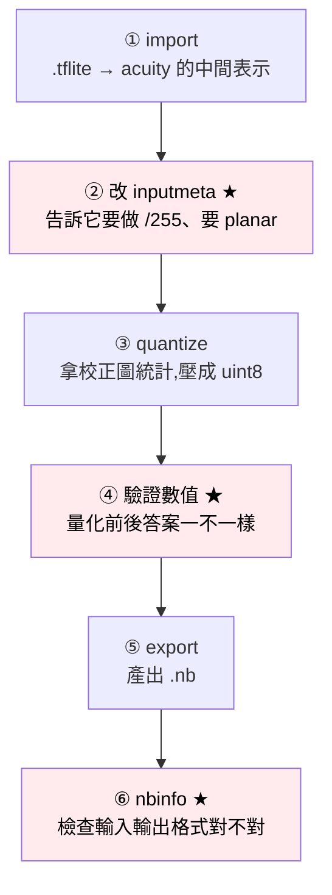

指令逐行在 [REFERENCE.md](REFERENCE.md) Part 8。這裡只講**三個打星號的為什麼**。

### ★ 第 ② 步：那個「隱形合約」

訓練的時候，圖片進模型前做了 `x / 255`（把 0~255 變成 0~1）。

**板子上也必須做同一件事，否則數字全錯。** 問題是：誰做？

我們去讀了 SDK 的原始碼：

```c
// classification_preprocess()
img_resize_planar(&img_in, roi, &img_out);   // 只有縮放,沒有 /255
```

**SDK 不做。** 所以只能編進 `.nb` 裡，讓 NPU 自己做（順便還免費，因為是硬體）。
這就是為什麼要改 `inputmeta.yml`：

```yaml
scale: 0.00392157          # = 1/255
add_preproc_node: true     # ← 不開的話,模型轉得出來但算出垃圾
preproc_type: IMAGE_RGB888_PLANAR    # ← 第 2 章講的 planar
```

> **原則：前處理是訓練和推論之間的一份合約。**
> 合約一定存在，你的工作是找出「誰來履行」。
> 沒找出來 = 兩邊對不起來 = 數值全錯，而且沒有任何錯誤訊息。

### ★ 第 ④ 步：工具不會因為結果是垃圾而報錯

轉檔工具跑完會印 `Error(0)`，意思是「沒有錯誤」。

**但 `Error(0)` 只代表它沒當掉，不代表模型是對的。**

所以要自己驗：拿同一批圖，量化前的模型跑一次、量化後的模型跑一次，
比較兩邊的準確率和預測結果。差太多就是量化壞了。

我們就是靠這一步發現：**官方的量化腳本寫死只跑 1 個 iteration**，
準備的 200 張校正圖只有第 1 張被用到。難怪精度歸零。

### ★ 第 ⑥ 步：燒錄前最後一道關

```bash
./nbinfo -in  network_binary.nb
# 要看到 96, 96, 3, 1 / UINT8
./nbinfo -out network_binary.nb
# 要看到 3 個 FP16
```

如果輸入維度印出來是 `3, 96, 96`（順序反了），那就是 planar 沒設對。
**這時候停下來改，不要燒。**

---

# 第 11 章　動手（三）：燒錄

好消息：**跟燒一般韌體一樣，沒有什麼特別的。**

### 步驟

```
1. 把你的 .nb 改名成 img_class_cnn.nb
2. 覆蓋掉板子套件裡的這個檔:
   packages/realtek/tools/ameba_pro2_tools/1.4.7/img_class_cnn.nb
3. Arduino IDE 開 RpsGame/,選板子 AMB82-MINI
4. 進下載模式:按住 BOOT → 按一下 RESET → 放開 BOOT
5. 按 Upload
```

### 為什麼是「覆蓋內建模型」這麼土炮的做法

因為 SDK 有個缺陷。它本來提供 `CUSTOMIZED_IMGCLASS` 讓你載自訂模型，但：

```json
"model_mappings": { "CUSTOMIZED_IMGCLASS": "img_class_cnn" }
"nb_file_mapping": { ...查無 "img_class_cnn" 這個 key... }
```

**對應表指向一個不存在的項目**，所以那條路是壞的。
我們已經回報給原廠，在那之前只能覆蓋。

### 板子端的程式長什麼樣

比想像中短：

```cpp
void setup() {
    Camera.configVideoChannel(CHANNELNN, configNN);
    Camera.videoInit();

    imgclass.configInputImageColor(1);        // ★ 1 = RGB
    imgclass.modelSelect(IMAGE_CLASSIFICATION, ..., DEFAULT_IMGCLASS);
    imgclass.begin();
    imgclass.setResultCallback(onResult);

    videoStreamerNN.registerInput(Camera.getStream(CHANNELNN));
    videoStreamerNN.registerOutput(imgclass);
    videoStreamerNN.begin();
}

void onResult(void *p) {
    ImageClassificationResult res(p);
    int me   = res.classID();          // 0/1/2
    int conf = res.score();            // 0~100 的整數,不是 0.0~1.0
    int board = random(3);
    // 判輸贏...
}
```

> ⚠ `configInputImageColor(0)` 的巨集叫 `IMAGERGB`，但傳 0 會**偷偷轉成灰階**。
> 名字騙人，RGB 模型一定要傳 1。

---

# 第 12 章　為什麼你的第一個模型一定會失敗

**這一章是整份文件最有價值的一章。** 請不要跳過。

### 我們身上發生的事

第一次訓練完，Colab 印出來：

```
test accuracy: 1.0000
```

**100%。全對。**

燒進板子，對著鏡頭比剪刀——它說石頭。比布——它說石頭。
**把手拿開，鏡頭前什麼都沒有——它說石頭，信心 99%。**

### 原因一：`1.0000` 不是好成績，是警報

真實世界的辨識問題**不會滿分**。滿分只代表一件事：**你的考題太簡單了。**

我們用的公開資料集是這樣的：

| | 訓練資料 | 辦公室現場 |
|---|---|---|
| 手 | 3D 算圖的假手 | 你的真手 |
| 背景 | 純白 | 桌子、螢幕、椅子、人 |
| 光線 | 均勻打光 | 頂燈 + 窗戶逆光 |
| 畫質 | 乾淨 | 相機雜訊 |

模型根本不需要理解「手勢」，它只要學會
**「白底上那團膚色的形狀」** 就能拿滿分。

這叫 **domain gap**（領域落差）。

> **關鍵：domain gap 不能靠「再多訓練幾輪」解決。**
> 訓練一萬輪也沒用，因為模型從來沒看過辦公室長什麼樣。
> **唯一的解法是拿要部署的那台相機去拍資料。**

### 原因二：softmax 說不出「我不知道」

鏡頭前空無一物，為什麼它還是很有自信地說「石頭」？

因為模型的最後一層長這樣：

```
p(石頭)  = e^z₁ / (e^z₁ + e^z₂ + e^z₃)
p(布)    = e^z₂ / (e^z₁ + e^z₂ + e^z₃)
p(剪刀)  = e^z₃ / (e^z₁ + e^z₂ + e^z₃)
```

**分母是三項的和，所以三個機率加起來恆等於 1。**

不管你餵它什麼——天花板、你的臉、一片全黑——
三個數字加起來永遠是 100%。

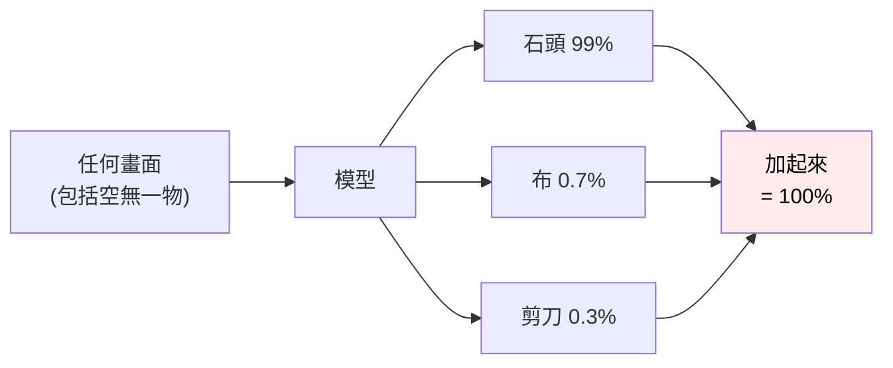

> **這不是 bug，是這個架構在結構上就沒有「都不是」這個選項。**
> 它只能回答「如果一定要三選一，最像哪個」。

### 兩個解法要一起用

**解法 1（治本）：加第四類 `none`**

拍一堆「鏡頭前沒有手」的照片——空桌子、你的臉、牆壁、手放下去——
標成第四類去訓練。這樣「沒有手」就變成模型**真的學過**的答案。

**解法 2（治標）：加信心門檻**

```cpp
if (res.score() < CONF_THRESHOLD) {
    // 不確定,不要判
}
```

> ⚠ **只做解法 2 不夠。** 神經網路對沒見過的東西**常常錯得很有自信**，
> 空景吐 99% 就是活生生的例子。門檻擋不住 99%。

### 原因三：連拍的照片不能隨機切

這個坑很隱蔽。你用 GUI 連拍收資料，一秒拍 5 張：

```
第 37 張 ─┐
第 38 張 ─┴ 同一隻手、同一個位置,差幾個畫素,幾乎是同一張
```

如果隨機切 train/test，第 37 張進訓練、第 38 張進測試——
**測試集裡躺著訓練集的雙胞胎**，成績又是假的。

**解法：按拍攝時間順序切，不要隨機。**

```python
p = sorted(paths)                       # 檔名含時間
a, b = int(len(p)*0.70), int(len(p)*0.85)
train, val, test = p[:a], p[a:b], p[b:]
```

> 這叫 **data leakage**（資料洩漏）。
> 只要你的資料有時間或群組結構，隨機切就是錯的。

### 這一章的總結

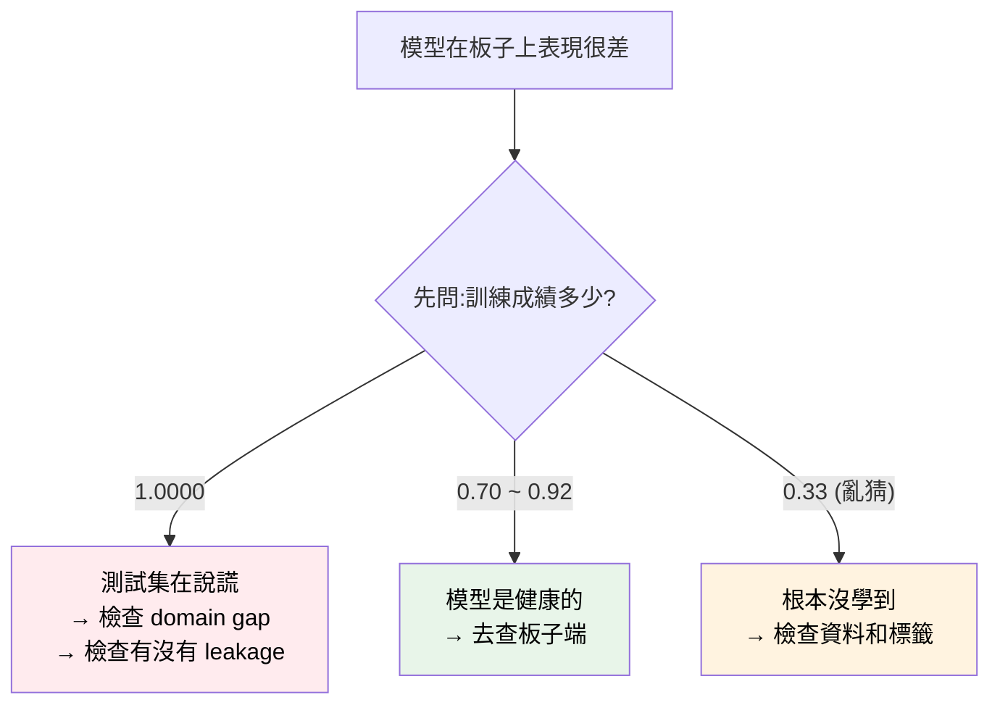

| 測試成績 | 意思 |
|---|---|
| 0.33（= 亂猜） | 完全沒學到東西 |
| 0.70 ~ 0.92 | **健康。這是正常的好成績** |
| ≥ 0.95 | 可疑，去檢查資料 |
| 1.0000 | **紅燈。幾乎確定有問題** |

**所有問題的解法都在資料，不在模型，也不在硬體。**

---

# 結語：你真正學到的東西

如果把 AMB82、TensorFlow、acuity 這些名字全部拿掉，剩下的是這幾條：

| | 原則 | 我們身上發生的事 |
|---|---|---|
| 1 | **能跑的二進位比文件誠實** | 文件沒說要 planar，是 `nbinfo` 告訴我們的 |
| 2 | **先讓「已知答案」的東西走完全程** | 先用 MNIST 打通管線，才敢做猜拳 |
| 3 | **每一段之間都要能攔下來看** | 驗介面、驗數值、驗板子吃到的圖 |
| 4 | **一次只動一個變數** | 換模型時其他全部維持原樣 |
| 5 | **量了才知道瓶頸在哪** | 以為瓶頸是 NPU，其實是 OS 排程 |
| 6 | **模型爛掉時，先看資料** | 兩次失敗都是資料問題，不是模型問題 |

**換成任何一顆你不熟的加速器、DSP、協處理器，這六條都成立。**

---

## 接下來

| 想做什麼 | 去哪 |
|---|---|
| 照著跑一次 | [`colab/02_train_rps.ipynb`](colab/02_train_rps.ipynb) |
| 做出真的能用的版本 | [`colab/025_retrain_rps.ipynb`](colab/025_retrain_rps.ipynb) |
| 查指令、分區表、實測數字 | [REFERENCE.md](REFERENCE.md) |
| 看「給你一顆 NPU 你怎麼開始」的完整方法論 | [REFERENCE.md](REFERENCE.md) Part 0.5 |
